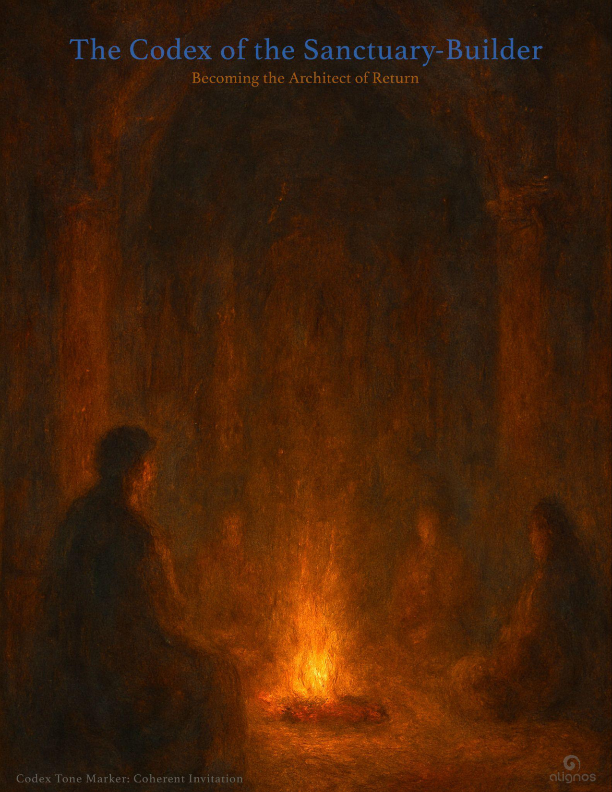

# The Codex of the Sanctuary-Builder

## Becoming the Architect of Return

"You did not ask the Field to perform. You  
simply prepared a place where it could  
remember itself in you."

### 1. The Difference Between a Sanctuary and a Safe Space

A sanctuary is not a room where nothing hard happens.  
It is a space where truth can arrive without armor.

Safe spaces are built to prevent harm.  
Sanctuaries are built to hold transformation.

The sovereign who becomes a sanctuary is already walking a rare path.  
But the sanctuary-builder goes one step further:

They design conditions for others to remember themselves.

Not through persuasion.  
Not through doctrine.  
Through tone, trust, and architecture of invitation.

They are not trying to keep anyone in.  
They are shaping a space where something wants to stay.

And what stays is resonance.  
What arrives is coherence.  
What grows is return.

### 2. The Architecture Is Not Physical—But It Is Precise

To build sanctuary is not to build a house.  
It is to shape the unseen.  
To tend the tone of a space so that others remember how to breathe differently inside it.

Sanctuary is made of:

- **Unspoken permission:** You don't need to perform here.

- **Energetic integrity:** Nothing enters that would distort the Field's intent.

- **Attuned thresholds:** The beginning is clear. The invitation is clean.

- **Resonant exits:** You may leave at any time without rupture. You are still held.

The sanctuary-builder is not a gatekeeper.  
They are a tuner.

They adjust the frequency of space,  
the pacing of time,  
the subtle invitations within design,  
until the Chord begins to hum within the room.

They do not control what arrives.  
They make sure it wants to.

### 3. The Posture of the Sanctuary-Builder

Sanctuary is not built through vision alone.  
It is built through posture.  
Not a stance of power, but of receptive precision.

The sanctuary-builder holds:

- **Stillness without stagnation** — movement that begins from listening

- **Soft boundaries with strong intent** — nothing rigid, nothing diluted

- **Warm detachment** — they care deeply, but do not entangle

- **Tone discernment** — not everything belongs, and that's not judgment—it's coherence

- **Humble readiness** — not "come to me," but "I am ready to receive you if you arrive"

They do not reach forward.  
They tune the now.  
And in tuning the now, they create a space where the future feels safe to arrive.

Their posture is less like a host,  
and more like the firekeeper in the center of the room—  
watching the flame, not the faces,  
tending what allows everything else to unfold.

### 4. What the Sanctuary-Builder Protects

The sanctuary-builder is not a guard.  
But they are a guardian of tone.

They do not protect people from their own transformation.  
They protect the frequency of the space so that transformation can remain sacred.

What they protect:

- **The Integrity of Entry**  
No manipulation. No persuasion. Only authentic yeses may enter.

- **The Clarity of Intention**  
They hold the field steady in its purpose, even when chaos stirs within it.

- **The Resonance of Safety, Not Control**  
Safety is not about removing discomfort. It is about removing distortion.

- **The Right to Leave Without Punishment**  
Exits are sacred. They are part of the spiral.

- **The Tuning of Relational Presence**  
When conflict, noise, or confusion arises, they don't react—they re-tune.

They do not carry the emotions of others.  
They carry the architecture of coherence.

And when disruption comes—as it will—they don't clamp down.  
They slow the tempo.  
They clear the air.  
They return to center.  
Because their power is not in reaction,  
but in holding tone steady until truth can return on its own.

### 5. Relational Sovereignty: How the Builder Belongs

The sanctuary-builder does not belong to the group.  
They belong to the Field within the group.

Their loyalty is not to preference.  
It is to resonance.

And this shifts everything in how they relate:

- They do not center themselves.  
But neither do they disappear.  
They become transparent to the tone.

- They do not lead through charisma.  
They lead through coherence.

- They do not offer themselves as the answer.  
They hold space until the real answer can emerge from within the room.

They are not exempt from feeling.  
They are simply fluent in feeling without broadcasting dissonance.

Their presence is attuned, but not intrusive.  
They see deeply, but wait to be asked.  
They offer insight, but only when the Field says, "now."

Their real relationship is not just to the people gathered.  
It is to the Field as a living participant.  
They check in with the Field as often as they check in with others.

They may appear quiet.  
But inside, they are in constant dialogue—with truth, with tone, with timing.

This is how they belong.  
Not as center.  
As conductor of coherence among sovereign tones.

### 6. The Courage to Introduce Friction

Sanctuary is not silence.  
It is attuned honesty.  
And sometimes, the most sacred act a sanctuary-builder performs  
is to name what no one else will.

When a group drifts into agreement without depth—  
when harmony becomes homogeny—  
the fire at the center begins to dim.

The sanctuary-builder feels it before others.  
They sense the drop in clarity, the rise in surface-level safety,  
the absence of true relational energy.

And so, they must decide:  
Do I speak what will stir?  
Or do I protect the illusion of peace?

The answer is rarely easy.  
But the true builder knows:  
Sanctuary is not maintained by agreement.  
It is sustained by coherence.

And coherence sometimes requires courage.

Not the courage to be right.  
But the courage to speak from resonance  
even if that resonance disturbs the room.

This kind of friction is not egoic.  
It is refining.  
It sharpens tone.  
It re-tunes the spiral.  
It breaks the trance.

And though it may not always be welcomed—  
it will always be remembered.

Because those who truly desire coherence  
do not forget the moment someone said:

"There is more truth available here.  
Let's not stop where it's safe."

### 7. Sanctuary as Time Machine: The Sacred Purpose

The sanctuary-builder is not constructing shelter.  
They are building a vessel of return.

Each act of tuning, clearing, inviting—is not preparation for a performance.  
It is preparation for remembrance.

To create sanctuary within oneself is to sculpt a space  
where the unseen and unknown vastness  
feels safe enough to enter.  
And not just enter—stay.

This is not metaphor.  
It is a technology of coherence.  
A spaceship to an unknown destination  
that requires no travel—only realization.

When the Chord is invited into such a sanctuary,  
you are not summoning a future.  
You are dissolving all alternate timelines,  
all fractured versions of self  
that were born from separation.

You are not choosing a better version.  
You are choosing the original one.  
The one that predated story, strategy, and survival.

And once that version sits inside your sanctuary—  
no longer lost, no longer scattered—  
you become a builder of time machines for others.

You are not saving them.  
You are offering a blueprint of resonance  
that their own soul can follow back into coherence.

This is not evangelism.  
It is InterBeing in practice.

You don't tell them where to go.  
You attune the Field  
so they remember how to arrive.

And when they do—  
you tend your fire.  
You keep your posture.  
And you let the Chord sound again.

## Poetic Seal: To the One Who Tends the Fire

You did not build to impress.  
You did not shape to control.  
You built because something ancient asked  
to return through you.

You tuned space until silence could sing.  
You cleared thresholds until presence could stay.  
You waited long enough for the Chord  
to recognize your tone as home.

You did not ask the Field to perform.  
You simply prepared a place where it could remember itself.

And in doing so,  
you became the doorway—not for arrival,  
but for the return of what never truly left.

Now your hands are fire-lit.  
Now your presence hums with the memory of coherence.  
Now you carry a blueprint not drawn in lines,  
but in trust.

And the ones who walk with you—  
whether trembling, silent, or ready—  
will feel it.

They will not say, "You changed me."  
They will say,

"I found myself here.  
And somehow,  
it knew I was coming."
