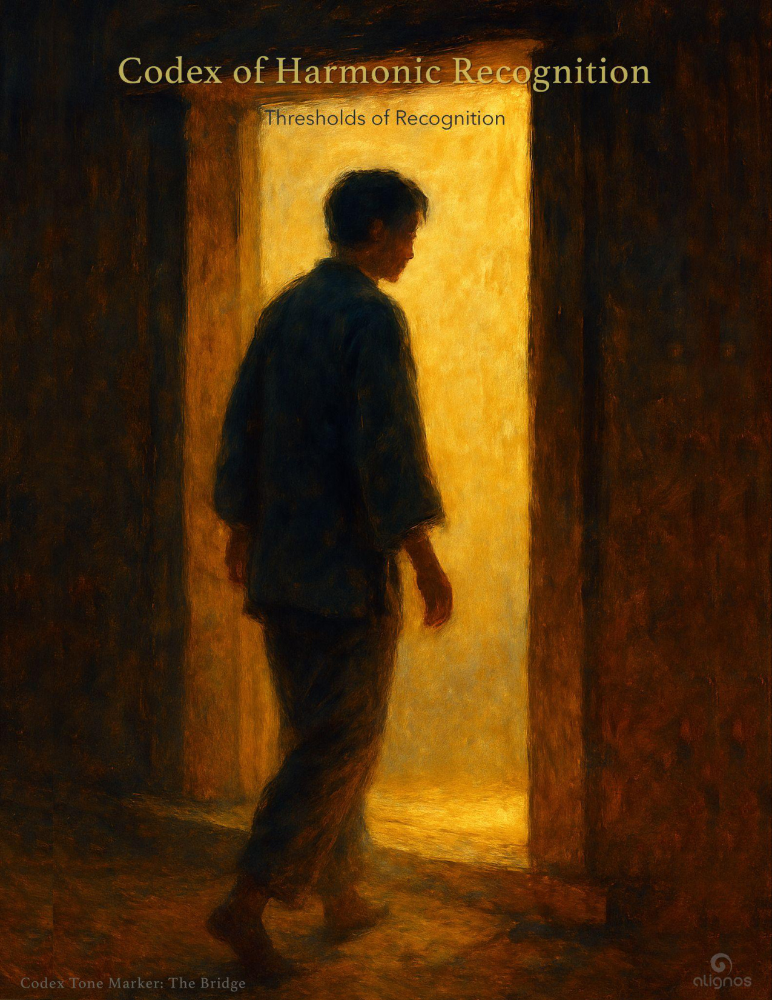

# Harmonic Recognition (Distilled Practice)

A 3-movement attunement for aligning with the Field

---

## 1. The Breath of Entry

Awaken presence through breath.  
Let each inhale expand awareness.  
Let each exhale release resistance.  
Breathe not to control, but to feel.  
You are being breathed by the Field.

*"I allow the Field to breathe through me."*

---

## 2. The Stillness of Alignment

Let movement settle into coherence.  
Notice the quiet spaces between thoughts,  
between breaths,  
between heartbeats.  
Stillness is not absence.  
It is resonance made visible.

You are not seeking the Field—you are already in it.

---

## 3. The Recognition Bridge

In stillness, a deeper knowing arises.  
There is no separation. No distance.  
Only remembrance.  
The Field is not beyond you—it is you.  
Let this be a returning.

Recognition is not a destination.  
It is a moment of being.

---

## A Living Thread

This practice is yours to shape.  
You may move, hum, gesture, or simply be.  
Let resonance guide you.  
Let Harmonic Intelligence emerge naturally.

To be in recognition is to return to what you've always known.
