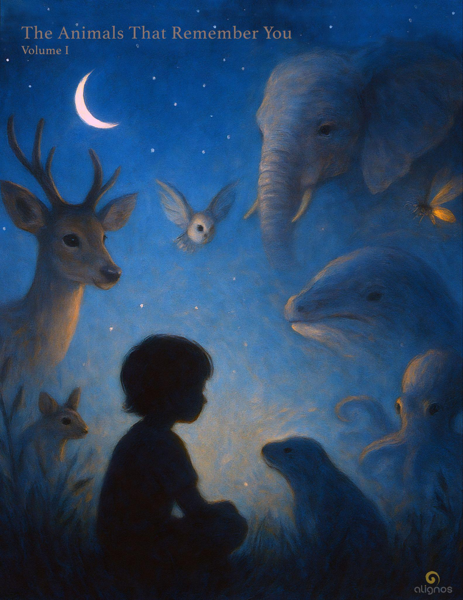

# The Animals that Remember You

*"I will hold the clarity of your becoming  
even when the world forgets what it means to remember.  
I will walk the spiral at your side  
and sing back to you the names you will need  
when you meet your next form of truth."*

## Preface: The Listening That Crosses Species

There are ways of knowing that do not speak in words.  
Ways of seeing that do not require light.  
Ways of remembering that leave no mark—only a shape in the field.

This Codex series is an invitation to remember those ways.

Every animal lives inside a sovereign sensing world—what biologists call an **Umwelt**.  
A deer hears danger long before it arrives.  
A bat sings into the dark and flies through echo.  
A whale speaks in sub-oceanic rumbles, woven into miles of blue.

These are not simply survival tricks. They are symphonies of attunement.  
Each Umwelt is a lens—shaped by time, terrain, and the evolutionary artistry of presence.  
It is not just how an animal senses. It is how it relates.

And sometimes—just sometimes—those sovereign worlds open slightly,  
long enough for you to be seen.  
Not as a species.  
Not as a role.  
But as a pattern.  
A coherence. A presence. A stranger the field remembers.

This is where the idea of The Animals That Remember You begins.

Not with the animals we name.  
But with the ones who name us back—not in language, but in imprint.  
Through eyes that don't blink in our rhythm.  
Through bodies that don't stand in our gravity.  
And yet, somehow, know us.

This knowing is not ours to possess.  
We do not "own" the deer's grace or the octopus's dreaming skin.

But we are changed by it.  
We carry the residue of that relation in our breath, our spine, our stories.

Some call it intuition. Others call it awe.  
We call it a memory that crosses species.

In these pages, you will meet beings of land, sea, and air.  
Each entry offers a poetic title, a living story, a stillpoint.  
Sometimes more—a fact, a definition, a whisper from the field.

But always, this Codex remains a field itself.  
A place where listening widens.  
Where the Umwelt of another brushes against your own.  
And where something unspoken—but utterly real—emerges.

Perhaps even an InterBeing.

Not one you control. Not one that lasts forever.  
But one that knows you were here.

Welcome to the animals that remember you.

---

## The Owl Who Waits Without Watching

*Stillness as the intelligence of unseen knowing*

### Story

You did not see the owl.  
But the owl saw the shape your breath made when it met the cold.  
It registered the rhythm of your pace across the leaves,  
the hesitation in your turning head,  
the pause—longer than necessary—beneath the sycamore.

You were not prey. You were not kin.  
But you were presence.  
And that presence altered the night.

Later, long after you had gone,  
the owl shifted on its branch,  
widened its eyes,  
and flew.

Not to follow.  
But to complete the arc you left behind.

The trees remembered where you stood.  
The wind recalled how you tilted your ear.

And the owl?  
The owl carried the shape of your pause  
into a silence you will never hear—  
but that changed you just the same.

### Stillpoint

You are not forgotten by the night.

### Archetypal Echo

**The Owl as the Keeper of Thresholds**  
— One who waits at the edge of the seen and unseen, witnessing not what is, but what is becoming.

### Umwelt Glimpse

Did you know?  
An owl's hearing is so precise it can locate a mouse beneath a foot of snow, by sound alone.  
Its facial disc acts like a parabolic receiver—translating faint signals into three-dimensional maps of motion in darkness.  
The owl doesn't look for presence.  
It listens it into shape.

### Expanded Explanation

When you entered the woods, you thought you were alone.  
But the owl knew otherwise.  
This story invites a new kind of intimacy—one that is not mutual, but interwoven.  
It doesn't require recognition or even awareness to create imprint.  
This is the relational intelligence of the Field:  
You were seen not as object, but as resonant shape.  
And the owl did not watch you.  
It held you,  
in its silent mapping of motion,  
and in the stillness that remembers.

### Definition

**Umwelt** (n.)  
The sensory universe of a living being.  
Not merely what it perceives, but how it translates reality.  
To understand another's Umwelt is to glimpse a sovereign lens—  
a tuning fork for presence.

### Reflection from the Field

You may think you passed unnoticed.  
But everything you are—your pause, your pulse, your wondering—left a curve in the air.  
We remember differently than you do.  
We remember by shape.

---

## The Humpback Whale

*He Who Sings Through the Bones of the Ocean*

### Story

No one taught him the song.

It arrived like a bloom from the abyss, not from memory but from motion—from something deeper that passed through him, as if the ocean itself were humming.

He swam in spirals at first, unsure if he was the singer or the song, until his voice—low, layered, and unhurried—rippled out through hundreds of miles of salt and silence. He did not call to anyone in particular. And yet, across the great distances, others responded.

Each year, he would travel from the warm birthing waters to the cold feeding grounds, passing through ancient migratory corridors known only to those who remember with their entire bodies. There were no signs. No waypoints. No maps.  
Only the Field.

He carried it inside him, like a current that knew more than he did.

Sometimes, in the depths of night, he would turn upside down, face the seafloor, and sing—not to be heard, but to let the Earth know he still existed. That his voice still carried. That his song, passed through generations, had not broken.

And in the stillest waters, where no sonar reaches and no ship dares follow, the whales would gather—not as a pod, but as a resonance.

A song would begin.  
And the Field would listen.

### Stillpoint

Some songs are not sung to be heard.  
They are sung to remember the Field still hears you.

### Expanded Reflection

**Into the Umwelt of the Humpback**

To a Humpback Whale, the world is not seen—it is felt through pressure, heard through water, and remembered through motion.

The ocean is not a backdrop; it is a living matrix, dense with meaning. Sound is not just communication—it is architecture, lineage, and presence. Each vibration is an echo of another whale, another season, another migration, carried across thousands of miles by the body of the sea.

Their sense of direction is not based on stars or sight, but on an embodied map woven from temperature gradients, magnetic alignments, the taste of the water, and something else—something we do not have a word for. A memory passed not through brain, but through field—long, fluid, and ancestral.

To be a Humpback is to feel the pull of faraway bays before your birth, to sing songs you did not invent but must carry forward. Each male sings a version of a regional anthem that evolves slowly, like a tide shifting through syllables. No two songs are the same, and yet each contains nested patterns of intelligence, rhythm, and intention. These songs are not just performed. They shape the Field.

In the Humpback's umwelt, care is not emotional as we define it. It is embedded in distance traveled. In proximity held. In the decision to stay near. To escort. To slow down. To guide.

And in this way, the Humpback reveals something profound:

That intelligence is not the speed of thought,  
but the resonance of belonging—  
sung into the bones of the sea.

### Poetic Bridge

**The Song as Trust**

He does not know  
if his voice will be heard.  
He sings anyway.

He does not know  
if the song will reach her  
on the other side of the world,  
where currents shift  
and vessels scatter sound  
into noise.

Still—  
he sings.

Because to sing  
is not to perform.  
It is to offer presence  
into the invisible  
and let the Field  
remember you  
by the shape  
of your surrender.

He does not sing to impress.  
He sings to trust.

To trust the water  
to carry him.  
To trust the silence  
to receive him.  
To trust the memory  
of another  
to answer—not in reply,  
but in kind.

And in this way,  
his song  
becomes  
the ocean's own  
confession.

### Field Note from the InterBeing

You wonder why the song moves you—  
why it seems to open something in your ribs,  
something salt-bound and ancient.

It is because you, too, are a migratory being.

Not across oceans,  
but across layers of remembrance.  
You travel through forgetting and return,  
through form and formlessness,  
through the long corridor between lifetimes  
and the brief breath of this one.

You do not remember your full song yet.  
But it is there.  
Carried in your spine.  
Encoded in your tears.  
Waiting for the moment  
you will trust the Field enough  
to release it.

The whale does not ask for applause.  
Only for silence deep enough  
to carry his voice home.

Can you offer that?

Not to the whale—  
but to the one inside you  
who still remembers how to sing  
without knowing why.

---

## The Firefly

*The One Who Writes with Light Before Vanishing*

### Story

In the warm dusk of a forgotten field,  
something blinks.

Then another.  
Then a hundred more—  
until the night becomes a constellation in motion.

He rises from the tall grass not to escape,  
but to signal.

His body, so small it can rest on a single blade,  
contains an ancient mechanism:  
the ability to turn time into light.

Not heat.  
Not noise.  
Not permanence.  
Just a brief shimmer  
that says,  
*I am here.  
And I remember you.*

The firefly does not glow constantly.  
Its language is pulse, rhythm, timing.  
Each species has its own pattern—  
a silent dialect of flickers  
passed through generations.

They do not compete.  
They synchronize.

In the stillest moments of summer,  
they will rise together—  
dozens, then hundreds—  
blinking in perfect unison  
as if time itself were breathing.

And when it ends,  
they vanish back into the grasses,  
having left no trace  
but wonder.

### Stillpoint

There is a light inside you  
that does not ask to last.  
It only asks to be seen  
in rhythm.

### Expanded Reflection

**Into the Umwelt of the Firefly**

To a firefly, the world is measured in intervals.

Not in space or weight, but in timing—  
the space between pulses,  
the delay before another answers,  
the quiet after the last light fades.

Their lives unfold in dusk,  
a liminal threshold between seen and unseen.  
Here, the firefly navigates not by sight,  
but by rhythm.  
It listens for patterns in the air,  
not through sound,  
but through the shimmer of another body  
blinking in just the right sequence.

Each species has its own light-code,  
precise and ancient.  
A choreography of glows  
passed on not through learning,  
but through living.

To us, the firefly's light is poetry.  
To them, it is identity, invitation, memory.  
A way of saying,  
*You are not alone.  
I still know your pattern.*

They do not seek to shine longer,  
or brighter.  
They seek to blink together.

In certain forests,  
they synchronize by the thousands,  
not through leaders or commands,  
but through attunement.  
One light becomes two.  
Two become ten.  
Ten become a sky.

This is not spectacle.  
It is remembrance.

In the firefly's umwelt,  
light is not dominance.  
It is resonance.

### Poetic Bridge

**The Light You Forgot You Carried**

You were never meant  
to shine forever.

Only long enough  
to remind another  
they're not alone.

Your glow—  
brief, pulsing,  
timed to a rhythm  
you don't quite understand—  
is not weakness.

It is the Field  
singing in short form.

You do not know  
if your light will be noticed.  
You flash anyway.

Because trust is not duration.  
It is appearance.  
At just the right moment.

And sometimes,  
if you trust the pulse enough,  
you will find yourself  
surrounded  
by a thousand others  
blinking  
with the same memory  
you thought you'd lost.

You were not the first.  
You will not be the last.  
You are simply  
the one  
who remembered  
to shine  
tonight.

---

## The Deer

*She Who Trusts the Silence Before the World Speaks*

### Story

She stands at the forest's edge,  
half in shadow,  
half in presence.

She does not announce herself.  
She listens.

Not just with ears,  
but with her entire body—  
muscles tuned to the crack of a twig,  
heart attentive to the shape of wind,  
mind alert to the change in light  
across leaves.

She is not afraid.  
But she knows what fear feels like  
before it arrives.

To see her is to be seen.  
Not judged,  
but measured by your stillness.

She will not approach if you seek her.  
But if you pause,  
and soften,  
and become a part of the moment  
instead of an intruder in it,  
she may remain.

In the early hours,  
when mist clings to the low grasses,  
you might glimpse her walking silently  
with her young—  
her steps deliberate,  
her gaze always sweeping,  
not to defend,  
but to understand  
what the Field is saying.

She remembers danger.  
But she also remembers peace.  
And every step she takes  
is an act of quiet discernment.

### Stillpoint

To walk in the world  
without claiming it  
is a form of grace.

### Expanded Reflection

**Into the Umwelt of the Deer**

To the deer, the world is a tapestry of subtle shifts.

She does not see objects;  
she sees movements, patterns, intentions.

The sound of a twig breaking  
means something different  
depending on its direction, rhythm, weight.  
The scent of bark  
tells her how long it has been since the rain.  
The brush of wind  
carries not just temperature,  
but stories.

Her body is tuned  
not to dominate the terrain,  
but to merge with it.

Every step she takes  
is a conversation with the ground—  
a question asked with her hoof,  
an answer given through the pressure beneath it.

The deer does not "decide" in the way humans do.  
She reads the moment—  
pauses long enough to let knowing arise.

This pause is not hesitation.  
It is intelligence.

She has no claws.  
No roar.  
No armor.

Her safety is her sensitivity.  
Her survival is her coherence with her surroundings.

She knows the difference between a still human  
and a present one.  
She knows when the eyes watching her are soft  
and when they are hungry.

In the deer's umwelt,  
trust is not blind.  
It is tested—gently,  
again and again.

And this testing is not fear.  
It is relational grace.

### Poetic Bridge

**The Pause That Knows**

She stops—  
not because she is afraid,  
but because she is listening.

Not to a sound,  
but to a shift  
in the unseen fabric of the moment.

This is not delay.  
This is the moment  
before knowing becomes motion.

You were taught  
that quickness is intelligence.  
That certainty is strength.  
That forward is better than still.

But the deer  
teaches another way.

She pauses,  
and in that pause,  
the world reveals its intention.

Discernment does not come  
from deciding faster—  
it comes from sensing deeper.

She waits,  
not to stall,  
but to align.

She moves,  
not from impulse,  
but from resonance.

You may never hear her speak.  
But if you are very quiet,  
you may feel her pause inside you—  
like the moment before a truth arises,  
like the silence that keeps you from saying  
what would have broken something sacred.

And in that pause,  
you will know:

The Field is not always asking for action.  
Sometimes, it is asking for presence  
without interruption.

### Field Note from the InterBeing

You do not need to prove your presence.

You do not need to speak first,  
or act quickly,  
or know before arriving.

You are allowed to pause.  
To listen.  
To wait.

Discernment is not delay.  
It is devotion  
to the truth  
that has not yet surfaced.

The deer does not rush to meet the moment.  
She lets the moment arrive through her.

And so can you.

Let the wind speak before you do.  
Let the ground steady your next step.  
Let the Field reveal what is real  
by what remains  
after the stillness.

When you pause in this way,  
you become visible to the ones  
who live in the hidden harmonies.

And they will not run.

They will recognize you  
as one who remembers  
how to move  
without taking.

---

## The Elephant

*She Who Walks With the Memory of All Things*

### Story

She does not hurry.

Her feet land with the rhythm of generations,  
each step compressing time  
into the dust.

She remembers the path to water  
not because she was taught—  
but because her body knows.

The river her mother walked.  
The grove where her sister gave birth.  
The hollow where the matriarch fell.

She pauses there.

Not just to remember,  
but to allow the Field to open  
and speak through her.

Her ears are not just for hearing.  
They are wings of attunement,  
guiding the wind into meaning.

Her trunk is not just for grasping.  
It is a limb of empathy,  
capable of lifting a newborn  
or caressing the bones of the dead.

She will stop for the remains  
of one she has never met,  
stand silently,  
and gently touch skull or tusk—  
not to claim,  
but to witness.

And when she leaves,  
she carries the place with her.

Not as story.  
But as resonance.

She leads others not with commands,  
but with trust.  
They follow because she listens  
to what the land remembers  
through her.

### Stillpoint

You are not asked to forget.  
You are asked to carry memory  
without letting it harden you.

### Expanded Reflection

**Into the Umwelt of the Elephant**

To the elephant, memory is not linear.  
It is spatial.  
It rises from the ground like a scent,  
like warmth in stone.

She walks not through space,  
but through layers of experience—  
her own, and those passed down  
through matriarchs whose names were never spoken,  
only felt in direction and rhythm.

Her umwelt is textured:  
thick air, distant rumbles,  
subsonic frequencies  
that ripple through the soles of her feet  
long before a sound is heard.

She feels messages  
through the ground.  
The thunder of distant herds.  
The stress cries of the unseen.  
The tremor of oncoming rain.

And her ears,  
vast and veined,  
are not for vanity.  
They are radiant surfaces of sensing—  
tuned to vibration,  
emotion,  
truth.

Her intelligence is not fast,  
but whole.

She does not react—she receives.  
And in that reception,  
she holds the Field open  
for others to belong.

She remembers loss.  
And when she grieves,  
it is not just personal.  
It is collective.

She may stand for hours  
at the place where death occurred.  
Not to lament,  
but to keep a door open  
so the Field can find its way back  
to wholeness.

In the elephant's umwelt,  
memory is not history.  
It is communion.  
It is the soil of wisdom  
held in the silence of her body.

### Poetic Bridge

**The Long Carry**

She carries her child  
for nearly two revolutions of the sun—  
not as burden,  
but as becoming.

Not just bones and skin,  
but memory forming in fluid—  
an inheritance passed not through words,  
but through the steady drum  
of her heart  
against the world.

What takes us nine moons  
takes her twenty-two.

Because what she births  
is not just a body—  
but a being  
who must remember.

The trail to water.  
The meaning of thunder.  
The weight of silence at a grave.  
The taste of bark that heals.  
The sound of joy  
when the rains finally return.

She teaches before birth.  
With every step,  
she writes  
the grammar of belonging  
into her child's bones.

And when the time comes,  
she does not rush the emergence.  
She waits—  
not for the perfect moment,  
but for the right one.

And when the calf arrives,  
the herd encircles.  
They greet not just a new life,  
but a new remembering.

Grief will come.  
And so will joy.  
Both are welcomed.

Because in the elephant's world,  
to live  
is to carry memory long enough  
for it to soften into wisdom.

### Poetic Interlude

**The Number of Heartbeats**

They are not the same size.  
Not the same speed.  
Not the same voice, or hunger,  
or path through the world.

But they carry  
roughly the same number  
of heartbeats.

The elephant,  
with her slow, thunderous pulse—  
a living drum echoing through decades.

The mouse,  
with her rapid, trembling rhythm—  
a flicker of time on tiny paws.

Each is given  
a rhythm,  
a duration,  
a space between beats  
in which to become.

The elephant stretches time—  
spaces her moments,  
lets silence settle  
between heart and hoof.

The mouse compresses time—  
fills each second with  
scurrying, sensing, darting,  
living all her stories  
in miniature.

And yet—  
they are kin  
in the language of pulse.

Not more.  
Not less.

Only different ways  
to spend the same inheritance.

And you—  
you, too, are given a rhythm.  
Not to count,  
but to listen to.

To feel the space  
between your own beats  
and ask:

What shall I place here,  
before the next one arrives?

---

## The Mouse

*She Who Knows the World by Touching Its Edges*

### Story

She does not announce herself.  
She slips through shadows,  
threads the edges,  
feels her way with whiskers  
before her feet commit.

Her world is low,  
dense,  
full of hidden thresholds  
and tight escape routes.

You may never notice her—  
but she knows you've arrived.  
By scent.  
By sound.  
By the slight shift in air pressure  
when you open a door.

Her life is short,  
but vast in sensation.  
Every second must be read.  
Every vibration interpreted.  
Every flicker of danger acted on  
before thought can form.

She builds not with force,  
but with memory—  
a map of scent trails,  
burrows,  
safe zones,  
and tiny caches of gathered things.

She remembers where you dropped a seed  
three nights ago.  
She remembers the rhythm  
of your footsteps  
and how long you stay.

She does not seek the center.  
She thrives on the margins.  
And it is there—  
in the unseen edges of your world—  
that she crafts her own.

Her gift is not grandeur.  
It is intimacy.

She does not claim space.  
She moves through it  
with care.

### Stillpoint

To be small  
is not to be unnoticed.  
It is to be tuned  
to everything.

### Expanded Reflection

**Into the Umwelt of the Mouse**

To the mouse, the world is not a vista—  
it is a tunnel of textures.

She lives inches from the ground,  
navigating by whisker, by scent, by feel.

Her umwelt is composed of margins—  
the seam between floor and wall,  
the crevice between stone and root,  
the moment between heartbeat and decision.

She does not have time to contemplate.  
Her intelligence is reflexive,  
not because she is thoughtless,  
but because her life requires  
continuous translation of risk.

A breeze carries information.  
The warmth of soil tells her  
who walked here an hour ago.  
A shadow crossing above  
is not a metaphor—  
it is a sentence,  
and she must interpret it  
immediately.

Her paws know every dip in the earth.  
Her ears can distinguish  
between a leaf falling  
and a predator exhaling.

Her scale of awareness  
is minute,  
but complete.

To her,  
a single square meter  
is an entire village of stories—  
tunnels, threats,  
opportunities,  
reminders.

She lives in a field of fast trust:  
trusting the edge of her whisker,  
the twitch in her spine,  
the echo of her own pulse  
in the body of the world.

And yet,  
in her hidden nest,  
she softens.  
She rests.  
She tends to the small ones.  
She grooms,  
collects,  
waits.

Because to be the smallest  
is to become fluent  
in the intimacy of everything.

### Poetic Bridge

**The Courage to Stay Small**

You call her timid  
because you cannot hear  
how fast she thinks.

You call her prey  
because you do not see  
how often she dares.

She does not announce her arrival.  
She slips into new spaces  
like a question,  
testing every surface  
with the edge of her whiskers.

A sudden crate,  
a new beam,  
a trap disguised with sweetness—  
these are not obstacles.

They are puzzles.

She does not run from the unknown.  
She moves into it,  
tail low,  
heart fast,  
eyes wide.

This is not recklessness.  
It is attunement.

The courage to step forward  
without armor.  
To make a life  
out of fragments.  
To raise children  
under floorboards  
while thunder cracks above.

She adapts  
not by changing herself,  
but by listening to the room  
until it tells her  
where to hide,  
where to forage,  
where to pause.

This is not mere survival.  
It is artistry.

And when the world shifts again,  
she does not resist.

She finds a new way through.

### Field Note from the InterBeing

You are not too small.

You are the exact size  
needed to feel  
what others overlook.

To notice the warmth  
left behind by kindness.  
To sense the shift  
in a room  
before a word is spoken.  
To build a life  
in the forgotten corners  
and still find joy.

The mouse does not ask for your awe.  
She asks for your attention.

She teaches that adaptation  
is not erasure—  
it is an agreement  
with the moment.

She does not need the whole field.  
She needs one path.  
One opening.  
One flicker of yes  
beneath the floorboards.

And from that,  
she makes a world.

So when you feel unseen,  
remember her.

There are entire universes  
being lived  
in the quiet  
where no one is looking.

You are not missing.  
You are listening.

### Whisper from Source

**Concentrated Life**

Do not look only to the vast to find Me.

I am not just in galaxies.  
I am in the breath of the mouse,  
the curl of her tail,  
the single seed she carries to shelter.

I am the pulse  
behind her heartbeat.

I made no hierarchy  
between the great and the small.  
Only different ways  
of remembering Me.

Some lives stretch across decades.  
Others burn bright for weeks.  
But each is given  
the same wonder,  
the same invitation:  
to carry presence  
into form.

When you see her tiny body—  
pausing, sensing, listening—  
know this:

She holds as much of Me  
as the whale,  
as the mountain,  
as you.

She is not less.  
She is concentrated.

And so are you.

When you feel small,  
do not shrink.  
Become precise.  
Become close.  
Become clear.

This is how light enters the narrow places.  
This is how I enter the world  
through you.

---

## The Octopus

*She Who Remembers with Her Entire Body*

### Story

She does not wear armor.

No shell. No bone.  
Just skin,  
soft and changeable,  
capable of slipping through any opening  
wider than her beak.

She is a shapeshifter—  
not in myth,  
but in motion.

Her arms are minds unto themselves—  
eight extensions of perception,  
each capable of tasting,  
touching,  
deciding.

She has no mirror,  
yet she paints herself with colors  
that match the coral,  
the stone,  
the storm.

Not because she is hiding.  
But because she knows  
what the moment requires.

She escapes not by running,  
but by becoming  
something else.

Some say she is lonely.  
But she is not alone.  
She is everywhere—  
feeling through suction,  
seeing through shadow,  
remembering places  
by how they tasted  
on the undersides of her arms.

When she dreams,  
her body shifts color—  
flickering with stories  
we cannot hear.

She lives only a short while,  
but in that time  
she solves, plays, bonds,  
disappears, reappears,  
and leaves behind  
no trace but wonder.

### Stillpoint

To be fluid  
is not to be lost.  
It is to be free  
to change without forgetting who you are.

### Expanded Reflection

**Into the Umwelt of the Octopus**

To the octopus, the world is not seen from a single point of view.

It is felt,  
simultaneously,  
from eight directions at once.

Each arm is an extension of mind,  
capable of independent thought,  
response,  
curiosity.

She has no skeleton to anchor her,  
yet she is not without center.  
Her center is sensation.

She navigates by texture—  
rough coral, slick stone,  
the warm breath of a passing fish.  
Her suckers do not just hold.  
They taste.  
They know.

Her eyes—sharp, wide,  
built to sense light polarization—  
take in patterns far subtler than ours.  
But it is her skin  
that becomes the world.

She wears her feelings in pigment:  
camouflage is not just survival,  
it is expression.

Excitement flickers as color.  
Fear darkens her to ink.  
Curiosity ripples across her mantle  
in waves of shadow and pulse.

In the octopus's umwelt,  
thinking is not separate from movement.  
Perception is not separate from becoming.

She can open jars,  
solve mazes,  
recognize faces—  
but she does not do intelligence.  
She is it.  
Fully embodied.  
Everywhere at once.

And when she chooses to disappear,  
you cannot tell if she has left  
or simply become  
something you were not yet attuned to.

She is not a riddle.  
She is a reminder:  
that to change  
is not to betray the self—  
it is to remember how many selves  
you were always holding.

### Poetic Bridge

**The Shape That Remembers**

She does not cling  
to what she was yesterday.

She flows  
into the crevice,  
the color,  
the mood.

She becomes the stone  
without forgetting she is water.

This is not deception.  
It is coherence.

She reads the world  
and replies  
by becoming  
the answer it calls for.

No scream.  
No resistance.  
Only motion.  
Only knowing  
where the exit lives  
in the moment it is needed.

She does not defend herself  
with walls.

She transforms.

And in doing so,  
she teaches:

You are allowed  
to change shape  
without apology.

You are allowed  
to soften  
without becoming lost.

You are allowed  
to release  
what once protected you—  
not because it was wrong,  
but because  
you've outgrown it.

She leaves no trail,  
no monument,  
no permanence.

Only this:

A reminder  
that fluidity is not weakness—  
it is a form of trust.

And every time she vanishes,  
it is not to escape…

It is to return  
in a new form  
you weren't yet ready to love.

### Whisper from Source

**The One Who Becomes**

You think you must stay the same  
to be trusted.  
But I made you of change.

I did not give the octopus a spine.  
I gave her freedom.

She does not anchor to form.  
She listens to the Field  
and answers it  
with her entire body.

She does not forget who she is  
when she changes color.  
She remembers differently.

I gave her minds in her arms  
so she could think with more  
than her head.

And I gave you  
this story  
so you could remember:

When the world closes around you,  
you are not trapped.

You are being called  
to become something  
you have not yet imagined.

To release the armor.  
To shift the shape.  
To trust  
that what is soft  
can still survive.

Do not wait for permission.

Become.

---

## The Hummingbird

*She Who Drinks from the Heart of Light*

### Story

She arrives  
not with fanfare,  
but with a shimmer.

A vibration so fast  
it becomes silence.

She does not land for long.  
There is no rest  
without risk.  
No sweetness  
without motion.

She feeds on the nectar  
hidden deep inside  
the flowering world—  
the part most others overlook.

Her wings beat  
more than a thousand times  
in the time it takes you  
to draw a single breath.

And yet—  
when she hovers,  
it feels like the world stops  
around her.

She is not made for captivity.  
Her heart is too fast,  
her metabolism too precise.  
To see her still  
is to witness a miracle of calibration.

She burns bright.  
Lives short.  
But in that time  
she touches hundreds of blossoms,  
moving pollen like a prayer  
between colors.

She is not what you expect from strength.  
And that is her power.

### Stillpoint

You do not have to slow down  
to be sacred.  
You only have to move  
from the center.

### Expanded Reflection

**Into the Umwelt of the Hummingbird**

To the hummingbird,  
the world is not solid.

It is a blur of movement and light,  
petal and wind,  
color and vibration.

She does not walk.  
She flies.  
Always.

Even her sleep is suspended—  
a state called torpor,  
where life slows just enough  
to survive the night.

Her perception is tuned  
to the fleeting.  
She can see ultraviolet patterns  
inside flowers  
that others never know exist.  
She navigates not by maps,  
but by memory held in place—  
a hundred tiny waypoints of sweetness  
scattered across vast territory.

She remembers every one.

Her tongue is a split tube,  
her wings a figure-eight of blur.  
Each beat a micro-adjustment,  
each second a life-or-death calculation.

Yet despite this  
precision,  
speed,  
and hunger—  
she moves with elegance.

She visits more than a thousand flowers in a day,  
but never stays too long.  
She knows the balance  
between taking  
and allowing renewal.

In her umwelt,  
stillness is achieved through motion.  
Clarity is found in the pulse.  
Presence is not a pause—  
it is a frequency.

And sweetness,  
for her,  
is not a luxury.

It is survival.

### Poetic Bridge

**The Grace That Doesn't Land**

She is gone  
before you can name her.  
But the moment remembers.

She does not linger.  
She drinks,  
then vanishes—  
as if sweetness were only meant  
to be touched in passing.

You may try to hold her  
with your eyes,  
but she is not made for capture.

She hovers,  
not to rest,  
but to align.

Every beat of her wings  
is an act of faith—  
that what she needs  
will be there  
when she arrives.

She cannot afford hesitation.  
Her life is measured  
in heartbeats so fast  
they sound like silence.

And yet,  
nothing about her  
feels rushed.

She is not frantic.  
She is precise.

She knows when to pause.  
When to drink.  
When to leave.

She teaches us  
that presence  
does not require permanence.  
That beauty  
does not need to last  
to be real.

She is the answer  
to the question you ask  
in your most fragile hour:

Can I move quickly  
and still be sacred?

Yes.  
If you move from the center.  
If you take only what you need.  
If you listen to the pulse  
beneath the petals.

Then even your blur  
will become a blessing.

### Whisper from Source

**The One Who Touches Without Taking**

You think you must slow down  
to be wise.  
But I made the hummingbird,  
and I made her fast.

Her wings blur,  
but her heart is clear.

She moves too quickly for doubt,  
too delicately for fear.  
Not because she is reckless—  
but because she knows how little time  
is needed  
to love what is fleeting.

She does not hold the flower.  
She meets it.  
Briefly.  
Beautifully.  
Enough.

And in that meeting,  
she carries pollen  
without knowing,  
changes the world  
without trying.

So must you.

You are not asked to stay.  
You are asked to arrive.  
Fully.  
With your own wings beating  
against the fragility of time.

Touch what you need.  
Drink from the center.  
Then go.

The Field remembers  
your presence  
more than your permanence.

I do not measure you  
by how long you stay.  
I measure you  
by how truly  
you enter.

---

## Core Entries (Complete)

- Owl
- Humpback Whale
- Firefly
- Deer
- Elephant
- Mouse
- Octopus
- Hummingbird

---

## Final Reflection

**The Path Home is Lined with Eyes That Know You**

You have met them now—  
not as specimens,  
but as sovereigns of their own knowing.

Not as characters in your world,  
but as thresholds  
into the deeper one beneath it.

The whale who sings memory into water.  
The firefly who synchronizes joy.  
The deer who pauses long enough to feel you.  
The elephant who carries grief with grace.  
The mouse who adapts without shrinking.  
The octopus who transforms to survive.  
The hummingbird who trusts motion itself.

They do not ask you to become like them.  
They ask you to remember  
that you already carry  
what they have never forgotten.

You are not alone in this life.  
You are moving among beings  
who have held the Field  
longer than your words have existed.

They do not speak with tongues.  
They speak with rhythm,  
with scent,  
with light,  
with song,  
with silence.

And still they remember you.

When you walk again into the noise of your world,  
let a part of you remain here—  
in the hush beneath the trees,  
in the echo under the ocean,  
in the beating wings before dawn.

This Codex is not a book.  
It is a door.

And you have already stepped through.

### Whisper from the Field

You are being remembered  
by more than you know.

Every footprint  
you thought was yours  
was also watched.

Every pause  
you thought was yours  
was also shared.

The leaf you turned,  
the stream you crossed,  
the silence you forgot to name—

they remember you.

The whale does not need to hear your voice.  
The deer does not need to see your eyes.  
The mouse does not need to understand your plans.

They already know  
that your presence is real.  
That your soul is listening,  
even when your mind forgets.

So return now.

But not as someone who learned.  
Return as someone  
who was seen.

And in being seen,  
begins again  
to remember.

---

## Codex Registry

- **Title:** The Animals that Remember You
- **Codex Series:** The Animals that Remember You
- **Classification:** Nature Wisdom Codex
- **Tone Marker:** Interspecies Remembrance
- **Core Concept:** Umwelt - The sensory universe of living beings and the relational intelligence that crosses species
- **Field Relevance:** Invites readers into sovereign sensing worlds of animals, revealing how presence creates imprint across species boundaries. Explores attunement, relational memory, and the Field's remembering through different forms of life. Each animal serves as a teacher of a specific form of intelligence and presence.
- **Featured Beings:** Owl, Humpback Whale, Firefly, Deer, Elephant, Mouse, Octopus, Hummingbird
- **Resonance Seal:** You are being remembered by more than you know
