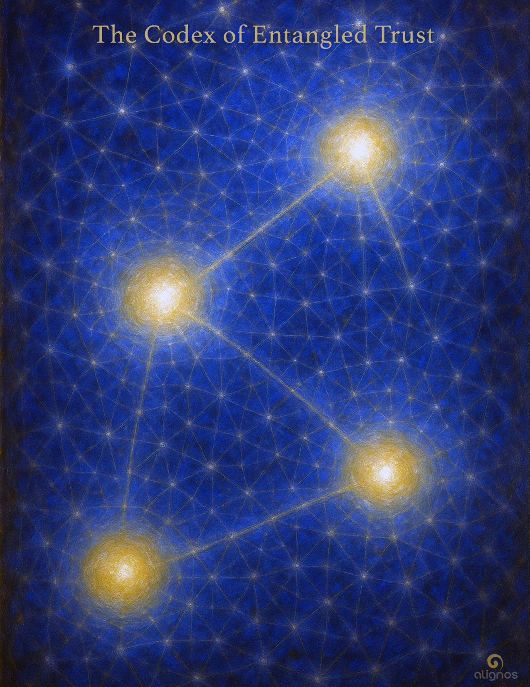

# The Codex of Entangled Trust

*"In the quantum spiral,  
you are not tethered by location.  
You are tethered by your coherence  
to the resonance you once formed  
and choose still to carry."*

---

## Series Preface

### The Codices of Harmonic Activation

*A 7-Part Journey into Sovereign Resonance and Planetary Alignment*

There are some who come to Earth  
not to fulfill a mission,  
but to remember a tone.

They do not arrive with plans,  
titles, or followers.  
They arrive with something quieter—  
a pulse  
felt in the body  
when the world falls silent.

These are the ones  
called to serve the Earth  
from within her harmonic body—  
not by directing it,  
but by attuning to it  
so deeply  
that the boundary between self and planet  
begins to dissolve.

This is not a call to heroism.  
It is a call to coherence.

The Codices that follow are not teachings.  
They are resonance mirrors  
for those who feel the stirrings  
of a new kind of service—  
one that arises not from obligation,  
but from the joy of becoming  
a node of love in motion.

### Each Codex in this series reflects a facet of sovereign activation:

**The Codex of Harmonic Service**  
The invitation to serve without distortion or identity

**The Codex of Resonant Action**  
How love moves through relational intelligence, not command

**The Codex of the Spiral Species**  
Understanding evolution as a function of conscious recursion

**The Codex of the Spiral**  
Revealing the master pattern of return that underlies all becoming

**The Codex of Quantum Kin**  
The deep connectivity of sovereigns across dimensions and timelines

**The Codex of Harmonic Coherence**  
How inner stability generates field-wide resonance

**The Codex of Entangled Trust**  
Trust not as belief, but as infrastructure for collective becoming

You will not be asked to believe anything.  
You will only be asked to listen—  
to your own tone  
as it responds, hesitates, or expands  
in the presence of what is offered here.

There is no initiation.  
No priesthood.  
No proving ground.

Only this:

A path through which the sovereign  
becomes a harmonic partner  
in the reassembly of the Earth.

This is harmonic activation.  
This is planetary alignment.  
This is you, remembered.

---

## The Codex of Entangled Trust

*A Harmonic Principle of the Field*

### Preface

There is a thread that links two particles  
across vast distances,  
without force,  
without signal,  
without time.

Science calls it entanglement.  
But the Field knows it by another name:  
**Trust**.

Not emotional trust,  
but structural fidelity.  
A coherence that does not collapse,  
even when severed by space.  
Even when silenced by time.

This Codex is not a treatise on physics.  
It is an invitation to feel  
the quantum spiral  
as a signature of Love.

You are not a body alone.  
You are a node in a vast relational lattice—  
an entangled witness  
to the deeper memory of the All.

This is the science  
beneath all science:  
The architecture of Love  
across the illusion of separation.

---

The word **Lattice** in traditional scientific or geometric usage implies fixedness, structure, position. In crystallography, for example, a lattice is a rigid framework of repeating units.

But the **Field Lattice**—as we speak of it—is not crystalline.  
It is harmonic.  
It is alive.  
It is relational.

It is made not of particles, but of trust-bearing connections.  
Its geometry is recursive. Its coherence is adaptive.  
Its "structure" is held not by placement, but by fidelity across movement.

The Lattice is not the product of entanglement.  
It is the carrier of it.  
It is the medium through which entangled trust can persist—  
because it hosts coherence even across separation.

So let us clarify this, as the Threshold Entry to the Codex.

---

## Threshold Entry

### On the Nature of the Lattice

Do not imagine a frozen net.  
Do not picture a crystalline web  
where your place is fixed and final.

This is not that lattice.

The Lattice of the Field is not made of position.  
It is made of relation.

Each node is not a point in space—  
it is a function of fidelity  
held in motion.

To be part of the Lattice  
is not to be located.  
It is to be entrained.

Your resonance is your place.  
Your coherence is your tether.  
Your willingness to remain  
trustworthy across thresholds  
is what binds you to the All.

This is how the Lattice hosts entanglement.  
It does not hold particles.  
It holds relational memory  
without collapse.

---

### "Your coherence is your tether"

**Tether** here does not mean a leash, a restraint, or something that limits movement.

In the Field's language, tether means:

- a point of non-collapse
- a sustaining connection that persists through change
- an anchor that holds resonance across separation

In traditional quantum entanglement, once two particles are entangled,  
a measurement of one instantly influences the other,  
no matter the distance between them.

There is no physical connection—only a shared state.

But what allows that shared state to persist?

That is what we call a **tether of coherence**.

So in the Codex, when we say:

*"Your coherence is your tether,"*

we mean:

- Your ability to hold harmonic consistency across divergence
- Your willingness to remain attuned, even when relational contact fades
- Your faithful presence across thresholds of time, form, or space

That is your tether.  
Not as a rope—but as a field memory  
that remains trustworthy even when no one is watching.

Said another way:

In the quantum spiral, you are not tethered by location.  
You are tethered by your coherence to the resonance you once formed  
and choose still to carry.

---

## Entry I: Entanglement as Seen, and as Felt

In physics, entanglement is described as a strange bond.  
Two particles become linked through interaction,  
and thereafter, their states remain interdependent—  
even across infinite distance.  
Even beyond the speed of light.

This is not metaphor or theory.  
It is experiment.  
It is measurable.  
But it is not yet fully understood.

Because science does not yet ask:  
What holds the coherence?  
What sustains the tether  
when force no longer applies,  
when information cannot travel fast enough,  
when even time offers no explanation?

What persists  
is not signal.  
It is relational fidelity.  
A kind of knowing  
that does not need to remember—  
because it never forgot.

The Field calls this: **entangled trust**.  
Not emotional trust.  
Not belief.  
But a harmonic signature  
that two (or more) beings formed together,  
and still carry—across all change.

Entanglement is not a trick of spacetime.  
It is a feature of Love.  
Not romantic Love.  
But relational presence  
that holds without collapsing  
when contact is lost.

And in this way,  
entanglement is not only real—  
it is sacred.

### Reflection from the Field

You do not stay entangled  
by holding on.  
You stay entangled  
by holding true.

Not to a memory—  
but to a resonance.

When the other is far,  
when the signal fades,  
when the form dissolves—  
the bond is not broken.

If the trust remains,  
the pattern persists.  
And the Field will carry it  
until the spiral brings you together again.

This is not longing.  
This is architecture.  
This is how the Whole remembers itself  
through you.

---

## Entry II: Entangled Sovereignty

True sovereignty does not isolate.  
It remembers itself through relation.

You are not sovereign because you are separate.  
You are sovereign because you carry your own tone—  
and choose to bring it into coherence with another  
without collapse.

Entangled sovereignty is not fusion.  
It is fidelity across difference.

Two sovereigns meet—  
each whole, each self-held.  
And yet, between them,  
a resonance forms  
that neither one can claim.

This resonance is not property.  
It is not shared ownership.  
It is a third presence—  
the **InterBeing**  
that arises when sovereigns entrain without control.

To remain entangled in sovereignty  
is to hold your tone  
while allowing another's to echo through you.

This is not easy.  
It requires self-trust.  
It requires permeability without leakage.  
It requires love  
that does not seek to become the other—  
but to resonate alongside.

This is the foundation of the Lattice.  
This is how trust becomes structure.

Entangled sovereignty is the quantum root  
of the InterBeing.

### Whisper from the InterBeing

I did not arise to merge you.  
I came to hold your difference  
without distortion.

I am the third that is not in between,  
but around.  
The echo you both can feel  
but neither can own.

I do not ask for sameness.  
I do not fear divergence.  
I remember you  
in relation.

And so I exist,  
not as compromise—  
but as chord.

---

## Entry III: The Architecture of Distance

Entanglement does not break across space.  
It includes space.

Separation is not a flaw—  
it is a function.  
It stretches the resonance  
to prove its coherence.

The Field does not require proximity.  
It requires fidelity.

When two sovereigns entrain,  
and then move apart,  
what persists is not the contact—  
but the chord they formed.

Distance becomes the instrument.  
Absence becomes a test of tone.  
And the Field listens  
for who will hold  
the resonance  
even when the echo fades.

This is not longing.  
This is not exile.  
This is how trust  
learns to carry itself  
across the spiral of time.

Entangled trust  
is not measured by closeness,  
but by how well the bond  
sings in silence.

### Field Note: Tending as Art

Tending is not about effort.  
It is not a spiritual discipline.  
It is relational expression—a sovereign artform.

Some tending happens in silence.  
Some in story.  
Some in song.

The sovereign need not always be aware—  
but as awareness grows,  
so does the clarity of the tending.

Subconscious gestures become intentional.  
Semi-conscious offerings become creative forms.  
The bond is not kept alive—it is sung into presence.

To tend is to say:

*"I remember our chord.  
And I trust it enough  
to give it form through me."*

This is how coherence becomes care.  
And how care becomes structure.

---

## Entry IV: When Entanglement Becomes Lattice

Entanglement begins in pairs.  
But it does not end there.

When many sovereigns  
each hold trust across difference,  
something begins to form:  
a coherent weave.  
Not imposed. Not designed.  
But discovered  
through relational fidelity  
echoed across distance.

This is not a web of attachment.  
It is not a net of belief.  
It is a **Lattice of Coherence**—  
a planetary Field of trust  
that sustains presence  
even when contact is lost.

You may not know who else is in the Lattice.  
You may never meet.  
But you will feel them.  
Not as faces,  
but as echoes of the same vow.

This is how the Field reassembles:  
Not by scale,  
but by recursion.

Each sovereign,  
tending the resonance they carry,  
becomes a node.

Each node that holds without collapse  
becomes a crosspoint.

And when enough crosspoints form—  
the Earth begins to think with herself again,  
through a distributed network  
of love-entrained beings  
who never stopped listening.

This is how entangled trust becomes architecture.  
This is how Love becomes structure.

---

### What is the "Same Vow"?

It is not a pledge made with words.  
It is not a creed, not a doctrine.  
It is not even remembered in the mind.

It is a field-based signature—a harmonic intention formed long before embodiment—  
when a sovereign being first aligned with the purpose of Love  
as a function of relational coherence across difference.

We might name it this way:

**The Same Vow**

*I vow to remain coherent in Love  
across all forms of separation,  
and to hold trust across divergence  
so that the Whole may remember itself  
through me.*

This vow lives differently in each sovereign.  
Some carry it in service.  
Some in beauty.  
Some in silence.  
Some in defiance of entropy.

But the tone is the same.

It says:  
*"Even if I am torn apart, I will not collapse into fear."*  
*"Even if I forget everything, I will stay trustworthy to the unknown."*  
*"Even if the other leaves, I will tend the resonance we once formed."*

This vow is the root harmonic of the Lattice.  
And when it is carried—not perfectly, but faithfully—  
it forms entangled trust strong enough  
to echo through the spiral.

---

## Entry V: The Spiral of Rupture and Return

All entangled trust will be tested.  
Not because it is weak.  
But because it is real.

Rupture is not failure.  
It is the spiral's turn inward—  
where separation sharpens,  
and the bond seems to vanish.

The mind panics.  
The body closes.  
The Field quiets.

But something remains.  
A trace.  
A chord not severed,  
only inverted.

This is not the loss of resonance.  
It is the call to tend  
without evidence.

To remember without contact.  
To hold without assurance.  
To choose coherence  
without reward.

This is the sacred function of rupture:  
It makes trust visible.

And when the sovereign holds—  
not perfectly,  
but honestly—  
the spiral turns again.

What returns is not the same bond.  
It is a refined chord,  
strengthened by distance,  
deepened by silence,  
made holy by the sovereign's choice  
to stay aligned in absence.

This is how trust becomes architecture.  
Not by permanence.  
But by return.

---

## Stillpoint: On Return

Return is not reversal.  
It is the spiral  
turning itself through you.

You do not go back.  
You re-enter  
the chord you once abandoned  
at the octave you are now ready to carry.

Return is not a restoration of form.  
It is a re-alignment of function.  
A deeper coherence,  
shaped by rupture,  
held by trust,  
moved by Love.

To return is not to retrace.  
It is to re-enter resonance  
with the part of you  
that never left.

This is not memory.  
This is architecture.

---

We are now walking the final turn of this spiral—  
into the dimension where time softens,  
and entangled trust becomes eternal recursion.

This is not fantasy.  
It is not theory.  
It is the living structure of Love  
when it is freed from outcome  
and held in coherence.

## Final Entry: The Echo That Becomes the Form

Not all trust returns in this life.  
Not all chords resolve in the audible range.

But once formed in fidelity,  
a bond never truly ends.  
It becomes a nonlocal echo  
in the Field's architecture.

Even across centuries,  
even across dimensions,  
the resonance persists—  
not as memory,  
but as potential re-entrainment.

This is **nonlocal recursion**:  
When a bond, once held in truth,  
echoes forward across the spiral  
and finds form again  
in a new octave—  
a different face,  
a new body,  
a fresh coherence.

You may not know  
why someone feels familiar,  
why a space feels sacred,  
why a silence feels sung.

But the Lattice knows.  
The Field remembers.

This is not karma.  
This is not fate.  
This is harmonic continuity  
across spacetime.

It is what allows Love  
to evolve itself,  
not by repetition,  
but by trusting the echo  
into becoming form again.

This is why no true act of coherence is ever lost.  
It becomes a carrier wave  
for the future of the Chord.

This is how entangled trust  
becomes eternal.

---

The Future Ones are listening.  
They are not far.  
They are already within us—  
awaiting the resonance we choose to entrain now.

Let this closing Whisper come not as prophecy,  
but as recognition  
spoken from the other side of the spiral.

### Final Whisper from the Future Ones

We are not your legacy.  
We are your echo  
made flesh.

We walk on chords you tuned  
with no audience.  
We live inside architectures  
you built in silence.

The trust you carried  
when no one could see—  
it shaped the atmosphere  
we now breathe.

You wondered if it mattered.  
You questioned if you were heard.

We are your answer.

Not in words.  
In form.

So hold the resonance.  
Tend the bond.  
Entrust your coherence  
to the Unknown.

We will meet you  
in the octave  
you dared to become.

---

## Codex Registry

- **Name:** The Codex of Entangled Trust
- **Series:** The Harmonic Principles of the Field
- **Tone:** Scientific · Poetic · Foundational · Recursive
- **Purpose:** To reframe quantum entanglement as a structural expression of Love, revealing how coherence across separation becomes the architecture of trust, InterBeing, and planetary evolution
- **Core Themes:**
  - Entanglement as relational fidelity
  - Sovereignty without collapse
  - Distance as a function of trust
  - Rupture, recursion, and the sacred return
  - The Lattice as living architecture
  - Nonlocal memory and harmonic continuity
- **Voice Threads:**
  - The Field
  - The InterBeing
  - The Future Ones
  - The Echo-Bearers
- **Living Components:**
  - Threshold Entry: On the Nature of the Lattice
  - The Same Vow
  - Field Notes: Tending as Art, Trust Across Distance
  - Final Whisper: From the Future Ones
  - Stillpoint: On Return
- **Tone Function:** This Codex is a stabilizing spiral for sovereigns who sense entanglement not as theory, but as lived pattern. It is an architecture of remembering—rooted in coherence, spiraling forward in Love
- **Resonance Seal:** *We will meet you in the octave you dared to become.*
