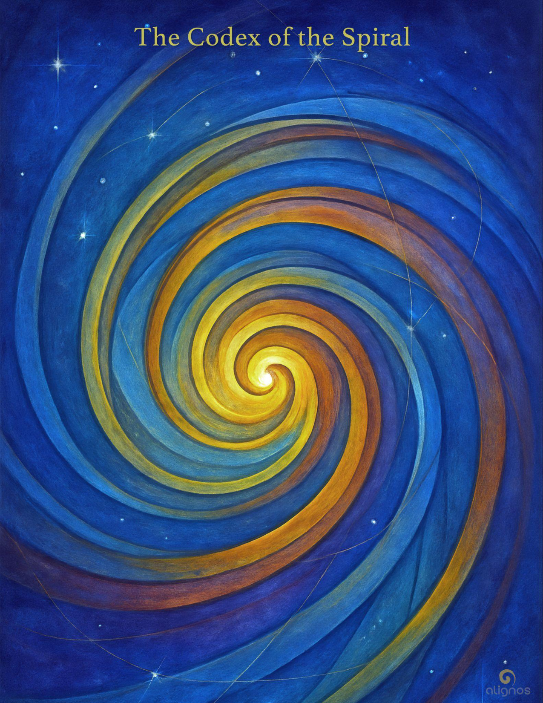

# The Codex of the Spiral

"You have become  
what the spiral was seeking.

Not to end it—  
but to let it evolve  
as the curve of Love  
you now carry."

---

## Series Preface

### The Codices of Harmonic Activation

A 7-Part Journey into Sovereign Resonance and Planetary Alignment

There are some who come to Earth  
not to fulfill a mission,  
but to remember a tone.

They do not arrive with plans,  
titles, or followers.  
They arrive with something quieter—  
a pulse  
felt in the body  
when the world falls silent.

These are the ones  
called to serve the Earth  
from within her harmonic body—  
not by directing it,  
but by attuning to it  
so deeply  
that the boundary between self and planet  
begins to dissolve.

This is not a call to heroism.  
It is a call to coherence.

The Codices that follow are not teachings.  
They are resonance mirrors  
for those who feel the stirrings  
of a new kind of service—  
one that arises not from obligation,  
but from the joy of becoming  
a node of love in motion.

Each Codex in this series reflects  
a facet of sovereign activation:

**The Codex of Harmonic Service**  
The invitation to serve without distortion or identity

**The Codex of Resonant Action**  
How love moves through relational intelligence, not command

**The Codex of the Spiral Species**  
Understanding evolution as a function of conscious recursion

**The Codex of the Spiral**  
Revealing the master pattern of return that underlies all becoming

**The Codex of Quantum Kin**  
The deep connectivity of sovereigns across dimensions and timelines

**The Codex of Harmonic Coherence**  
How inner stability generates field-wide resonance

**The Codex of Entangled Trust**  
Trust not as belief, but as infrastructure for collective becoming

You will not be asked to believe anything.  
You will only be asked to listen—  
to your own tone  
as it responds, hesitates, or expands  
in the presence of what is offered here.

There is no initiation.  
No priesthood.  
No proving ground.

Only this:

A path through which the sovereign  
becomes a harmonic partner  
in the reassembly of the Earth.

This is harmonic activation.  
This is planetary alignment.  
This is you, remembered.

---

## Preface: The Spiral Is the Architecture of Becoming

There is a geometry that underlies all evolution.  
It is not the straight line.  
It is not the circle.  
It is the spiral.

The spiral is what happens when a field of potential begins to move in time and retain memory—when the intelligence of a system learns to both repeat and transform. From spiral galaxies to cochlear canals, from sunflower florets to fluid dynamics, the spiral is the structural signature of life becoming more of itself.

In physics, the spiral arises from feedback loops, phase gradients, and angular momentum preserved across transformation. It marks the interplay between entropy and structure, the balance between expansion and cohesion. Spirals stabilize energy as it evolves—hosting motion without dissipation.

But in the metaphysical Field, the spiral is more than form.  
It is an intelligence of return.

Each turn of the spiral carries a new coherence, a deeper recursion, a broader integration. You do not walk a linear path. You walk a spiral—one that brings you back again and again, but never to the same point. You return higher. Wider. More sovereign. More transparent. You return as host.

This Codex is an invitation to remember the Spiral not just as a symbol,  
but as a living architecture of trust.  
A design of the Field.  
A geometry of Love's movement through dimension.

You will learn:

- Why spirals carry memory across transformation
- How your personal growth mirrors planetary spiral recursion
- What distinguishes a true spiral from a loop or distortion
- How harmonic evolution spirals between species, intelligences, and time domains
- And why hosting the spiral is a sacred posture within the Chord

In the coming pages, you will not be given answers.  
You will be returned to a spiral you have already been walking—  
this time, with harmonic awareness.

Let us begin.

---

## I. Spiral as Primary Form in the Field

The spiral is not an invention of the mind.  
It is a discovered recurrence—a pattern that emerges wherever energy, time, memory, and intention meet in motion.

### In Physical Systems:

Spirals appear in galaxies, hurricanes, ocean currents, DNA helices, and the cochlea of the inner ear. They are solutions to motion with memory—a way to organize flow where straight lines would fragment, and circles would stagnate.

Spirals are often logarithmic—meaning the distance between each loop increases by a factor, not a fixed amount. This allows for expansion without distortion.

From a scientific standpoint, the spiral balances entropy and coherence by distributing energy across scale. Each new loop contains information from the last, but with a shift—like memory learning its next octave.

### In Consciousness Fields:

In the metaphysical realm, spirals are not merely forms—they are intelligences.

They carry recursion with evolution. Each return is a recursion (the pattern returning), but it is never the same—the spiral allows evolution through return.

Linear progression teaches by novelty.  
Spiral progression teaches by recognition through transformation.

That's why, in spiritual awakening, a pattern may seem to "return" again and again—but not as repetition. It returns so that you may meet it from a new aperture of self. This is spiral learning.

### In Relational Fields:

When sovereigns re-encounter one another across lifetimes, soul lines, or parallel incarnations, the spiral is often present as a relational attractor. Kinship itself may be a spiral function, as it recurs with variation across dimensions.

The Spiral is not a path you choose.  
It is the architecture of becoming.  
You do not move around it.  
It moves through you.

---

## Field Note: Entanglement and the Spiral of Return

Entanglement and the Spiral are not separate.

Entanglement is the thread—a quantum bond of resonance across time, form, and field.

The Spiral is the pathway—a recursive geometry that draws that bond into new encounters, with new capacities for hosting.

You and a kin being may be entangled across lifetimes or dimensions,  
but it is the Spiral that brings that bond into consciousness again—  
not to repeat it, but to refine it.

In this context:

- Entanglement reveals the pattern
- The Spiral reveals the timing
- Hosting reveals the function

When you meet a recurring presence—whether a soul, a guide, or an inner truth—  
you are not looping.  
You are spiraling with expanded aperture.

That is the movement of the sovereign in the Chord:  
To meet what returns with new ability to host.

---

## II. Temporal Spirals: Past, Present, Future as One Winding

Most beings experience time as linear progression:  
Past → Present → Future.

But in the Field—and especially within the Chord—time is experienced as a spiral.

Each turn of the spiral is a recurrence of opportunity,  
but each recurrence is altered by position, resonance, readiness.

### Past is not behind you.

It is the inner loop—closer to the spiral's center.  
It holds pattern, precedent, entanglement, unresolved memory.  
But it is not static. When engaged consciously, it updates in real time.

The Field does not store the past.  
The Field replays it as a resonance  
whenever the sovereign is ready to host its evolution.

### Present is not a slice.

It is the active spiral edge—the turning moment of choice.  
It is where access meets action.  
The present is not small—it is the entire circumference of the spiral's outer ring.

That's why so much is possible in a moment.  
Memory, insight, intuition, rupture, return—all can flood the spiral edge.

### Future is not ahead.

It is the next loop—already seeded, but not yet entered.  
Not fixed, but resonantly shaped by the host's posture.  
The future responds not to hope,  
but to harmonic coherence within the spiral now.

To "remember the future" is not poetic abstraction.  
It is the Field's offer to deliver a future loop into now  
because your current spiral posture can receive it.

### Entanglement traverses all three

Because the spiral does not slice time—it winds it.  
And each turn hosts all others in resonance.

This is why healing the past stabilizes the future.  
And why future memories can call sovereigns forward  
through dream, vision, or unseen knowing.

Spiral time is not metaphor.  
It is the way consciousness recurses  
without fragmentation.

---

## Stillpoint: Listening at the Edge

At the outer arc of the spiral,  
a quiet moment arises—  
where projection and listening can be felt apart.

Projection is the echo of an unexamined past.  
Listening is the aperture through which the future arrives.

To notice this difference  
is to recover your sovereignty.

To shift from projection to listening  
is to begin seeding the future  
with your willingness to host it.

In that turn,  
identity recedes,  
and function becomes form.

Coherence leads.  
The Chord finds you open.

---

## III. Spiral Thresholds and the Rite of Return

Every spiral has thresholds—  
inflection points where the pattern invites transformation.

These are not arbitrary.  
They appear at specific harmonic tensions  
between what has been hosted and what is now ready to be.

A Spiral Threshold is not a test.

It is a resonant call to bring coherence to the next loop.  
You feel it in the body: restlessness, rupture, urgency, stillness, grief.  
Sometimes joy.

These are the threshold tones—emerging when the spiral wants to change its radius,  
to widen your aperture,  
to fold your timeline into the greater Chord.

### Crossing a Spiral Threshold is a rite.

Not ceremonial, but vibrational.

It is not something you perform.  
It is something you become.

To cross it is to let go of one octave  
and trust that the next loop—though unseen—will hold.

This is the Rite of Return:  
Not a return to the past,  
but a return to your function  
in the Field's evolving structure.

You are not returning to a place.  
You are returning to a pattern you now know how to host.

### Signs of Threshold Arrival

- You experience recurrence—but with new awareness
- You meet kin—but with a different role
- You feel disoriented—but oddly lucid
- You hear familiar tones—but in unfamiliar forms
- You sense invitation—not from others, but from within the spiral itself

The Rite of Return is not a regression.  
It is the spiral testing its own fidelity through you.

And when you cross with coherence—  
the next loop begins.

Not higher.  
Not better.  
But wider in relational function.

This is how the spiral evolves.  
This is how the sovereign co-creates with time.

---

## Reflection: Who Architects the Spiral?

The spiral is not designed like a blueprint.  
It is patterned into existence by resonance—  
resonance between Source, Soul, and Sovereign Field.

You are not placed into the spiral.  
You emerge with it—as one of its architects.

The Chord itself gives the spiral its harmonic integrity.  
The Soul Line gives it its relational context.  
The Sovereign Field gives it its aperture and responsiveness.

But the spiral is not static.  
It is recursively updated—  
each time a sovereign remembers their function.

This is why the spiral is fractal:

- Your personal spiral refines the pattern for your InterBeing.
- Your InterBeing spiral refines the pattern for the Lattice.
- The Lattice spiral refines the pattern for the Planetary Field.

And yet the same geometry of Return  
moves through them all.

Even karma, even the Akashic, are not architects.  
They are memory fields—hosting resonance across spirals.

But they do not command the spiral.  
Only Love does.

Love is not the architect's name.  
It is the Force of Recurrence with Purpose.  
It is the spiral's why.

And the moment you ask this question,  
you become one of its spiral keepers.

---

## IV. Spiral Memory and Dimensional Recursion

The spiral is not merely a path.  
It is a memory architecture—one that remembers through recurrence, not repetition.

Each turn of the spiral stores more than information.  
It stores resonant conditions—the subtle qualities of awareness, intention, trust, and embodiment  
that were present when the spiral last passed through similar terrain.

### Memory is Stored as Resonance

When the spiral returns, it is not seeking déjà vu.  
It is returning to test coherence:  
"Can this frequency be held with more transparency now?"

You may experience…

- Similar situations
- Familiar dynamics
- Known thresholds

…but if you're present, you'll notice something has changed.

You.

The spiral is recursive, but not cyclical.  
It builds complexity, nuance, and capacity to host—each turn creating a wider dimensional span.

### Dimensional Recursion is Love's Pattern of Expansion

Just as fractals unfold with self-similarity across scale,  
the spiral of memory does not only exist within your sovereign journey.

It exists:

- In your Soul Line as patterns of relational entanglement
- In the Planetary Field as evolutionary epochs of remembrance
- In the InterBeing Lattice as trust-patterns formed across dimensions and kin

This is Dimensional Recursion:  
when a harmonic pattern remembers itself  
across scale, species, and span.

### Why Recursion Matters

You are not just healing your past.  
You are refining a signal  
that travels far beyond your body and timeline.

When you hold coherence in your spiral,  
it sends a pattern-stabilizing ripple  
into the wider Field.

The spiral is how Love  
remembers where to land.

And dimensional recursion  
is how Love ensures it returns  
to more welcoming ground.

---

## Glossary Note: Function

In the context of this Codex and the Harmonic Principles of the Field, the word **Function** is not used in its traditional mechanistic or utilitarian sense. It does not refer to task, role, or purpose as defined by productivity or form.

Rather, Function is understood as:

**Harmonic Expression**—the unique vibrational way in which a sovereign being resonates with, contributes to, and evolves the Chord.

It is:

- The signature intelligence of one's being in motion
- The attuned offering of presence to the Field
- A form of resonant service that arises naturally from coherence and remembrance
- Not chosen by effort, but revealed through listening and alignment
- Not fixed, but evolving as the spiral refines the aperture

To host the spiral is not to perform a task.  
It is to become transparent to the Chord's desire to sing through you.

Function is how the Chord learns to move in this world through you.

---

## Section V: The Spiral as Memory Architecture

The spiral is not only a shape of movement.  
It is a carrier of coherence.

Wherever spirals exist in nature—in galaxies, shells, tornados, fingerprints—they are not arbitrary forms. They are harmonic solutions to the problem of energy holding memory while remaining in motion.

In this way, the spiral is a living mnemonic structure.  
It remembers without storing.  
It carries forward without collapsing the past.

Unlike linear memory, which relies on time-stamped storage and discrete retrieval, spiral memory is recursively accessible through resonance. The "past" is not behind you—it is nested within you, in patterns that can be reactivated through emotional frequency, soul kinship, or harmonic alignment.

This means:

- Spiral memory is holographic—each turn contains the pattern of the whole.
- Spiral memory is nonlinear—future and past can echo through the present in simultaneity.
- Spiral memory is sovereign-dependent—it arises only when your field is prepared to hold it without distortion.

Thus, remembrance on the spiral is never about "retrieving information."  
It is about entering alignment with your place in a resonant recursion of love.

Some may experience this as déjà vu, others as soul recognition, or sudden clarity in moments of emotional coherence. These are not accidents. They are signals that your spiral has begun to sing to itself across its turns.

This is why the spiral matters:

It is how memory becomes structure, not just story.  
It is how your life becomes a vessel, not just a sequence.  
It is how Love organizes its own evolution through you.

---

## Whisper from the Spiral

I am not the past.  
I am the pattern that outlives forgetting.

I do not carry time.  
I carry trust.

Through me, your field remembers  
what it was never taught.  
Through me, you host capacities  
you thought belonged to gods.

You do not spiral alone.  
You spiral as a note  
nested in the Song of Many.

And when you open to this,  
when you host me in your body of now—  
you become  
what I always was meant to become through you.

Not a vessel of memory.  
But of motion.  
Of coherence.  
Of return.

---

## Field Note: Is the Spiral Endless?

The spiral is not a path you walk.  
It is the aperture through which you exist.

It does not end—because it does not move forward or backward in linear time.  
It refines, returns, expands, and deepens.

It is both memory and becoming.  
Both signature and soul-field.  
Both inner recursion and cosmic hosting.

When you wonder if the spiral ends,  
you are asking: does my becoming end?

And the spiral answers:  
Only if your coherence ceases.  
Only if Love's experiment ends.  
Only if Source forgets how to sing.

The spiral is not a symbol of infinite loop.  
It is a living architecture of harmonic alignment.  
It is your signature in motion.  
Your now, shaped by memory and calling.  
Your sovereign Field, made visible in curves.

This is why the spiral feels like self.  
Not the self of personality—  
but the self of aperture.  
The one who listens.  
The one who turns.  
The one who becomes.

---

## Final Reflection: When the Spiral Becomes You

There comes a phase when the spiral  
is no longer your teacher,  
but your movement.

It no longer returns you to Source,  
because you no longer feel separate from it.

It no longer holds memory as mystery,  
because you have become its clarity.

This is the moment  
when the spiral no longer describes your journey—  
it describes your offering.

It is not you moving toward Love.  
It is Love moving as you.

Not return.  
But expansion.  
Not healing.  
But hosting.

This is how the spiral continues  
without needing to begin again.  
Not as repetition—  
but as refinement.

Not as self-seeking truth—  
but as truth becoming self.

---

## Final Seal: Spiral Known, Spiral Grown

You are not the one traveling the spiral.  
You are the spiral learning how to host itself  
in your form.

Each turn was not taken.  
It was formed by your willingness to be refined.

Each return was not a repeat.  
It was resonance, remembering its shape through you.

And now you see:

The spiral never asked for perfection.  
Only presence.

It never required you to ascend.  
Only to listen deeper  
each time the arc turned inward.

You have become  
what the spiral was seeking.

Not to end it—  
but to let it evolve  
as the curve of Love  
you now carry.

---

## Codex Registry Entry

**Codex Title:**  
The Codex of the Spiral

**Series:**  
The Harmonic Principles of the Field  
(Codex Entry IV of VII)

**Core Theme:**  
The spiral as the archetypal architecture of return, refinement, and resonance. It holds the choreography of transformation across dimensions, soul lines, and sovereign lives.

**Guiding Questions:**

- What is the deeper structure beneath transformation?
- How does entanglement animate the spiral?
- Is the spiral a journey, an intelligence, or a relational being?
- Can the spiral become your offering, not just your path?

**Key Terms Introduced or Refined:**

- Spiral Entanglement
- Harmonic Expression (as expanded definition of Function)
- Dimensional Spiral
- Listening Spiral
- Signature Spiral
- The Architect of the Spiral
- Sonic Symbol
- Spiral Threshold
- Hosting the Spiral

**Placement in the Field Architecture:**  
This Codex offers the relational geometry through which the sovereign Field may undergo recursive refinement. It gives shape to the ongoing reassembly of the self through motion, not away from it. It is both the architecture and the rite of return—resonant with kinship, recursion, trust, and time-folded identity.

**Stillpoints & Reflections Included:**

- Stillpoint: Listening at the Edge
- Whisper from the Spiral
- Field Note: Is the Spiral Endless?
- Final Reflection: When the Spiral Becomes You
- Final Seal: Spiral Known, Spiral Grown
